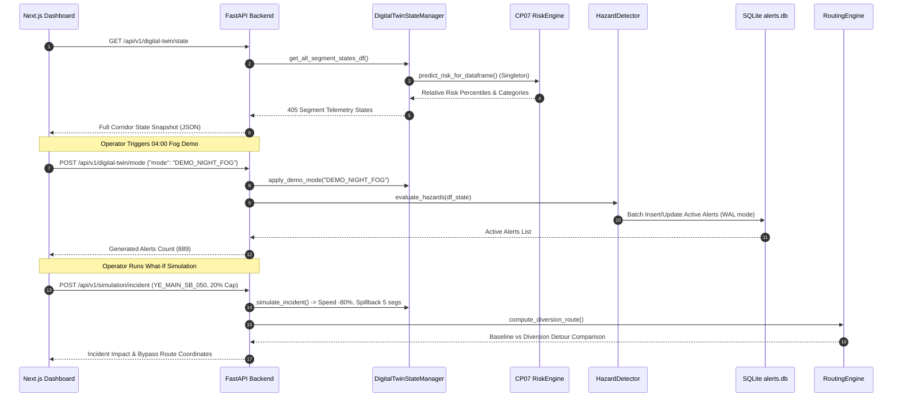

# ROADTWIN AI — FINAL SYSTEM ARCHITECTURE
**Smart India Hackathon 2026 — Team CltAltDefeat (ID 404)**
**Corridor: Yamuna Expressway (Greater Noida → Agra, 165 km)**

---

## 1. High-Level Architectural Overview

RoadTwin AI is built on a decoupled, microservices-ready architecture comprising a **Next.js 15 Command Center Frontend** and a **FastAPI Spatio-Temporal Intelligence Backend**:

```mermaid
graph TD
    subgraph UI ["Frontend Presentation Layer (Next.js 15 / React 19)"]
        A[MapLibre GL JS Corridor Map]
        B[Live Telemetry & Risk HUD]
        C[Active Alert Stream & Feed]
        D[Dynamic LED VMS Gantry Displays]
        E[Patrol Deployment Panel]
        F[Event Timeline Audit Trail]
        G[SIH 10-Step Demo Controller]
        H[Engineering Diagnostics Modal]
    end

    subgraph API ["FastAPI Backend & Middleware Layer (Python 3.11)"]
        I[X-Request-ID Correlation Middleware]
        J[CORS Allowlist Security]
        K[Centralized Config: scripts/config.py]
        L[REST Endpoints: /state, /alerts, /simulation, /routing]
    end

    subgraph Engines ["Core Spatio-Temporal Digital Twin Engines"]
        M[DigitalTwinStateManager: In-Memory 405 Segments]
        N[CP07 RiskEngine: XGBoost 31 Features Singleton]
        O[HazardDetector: Operational Rule Engine]
        P[AlertEngine: SQLite Deduplication & Lifecycle]
        Q[VMSAdvisoryEngine: Policy Matrix Recommendations]
        R[IncidentSimulator: Capacity Reduction & Spillback]
        S[DynamicRoutingEngine: Layer B Dijkstra 1863 Nodes]
        T[EmergencyDispatchEngine: SIMULATION_DEPOT Routing]
    end

    subgraph Storage ["Persistent Storage & Data Foundation"]
        U[(alerts.db: SQLite WAL Mode)]
        V[405 Segments Parquet: CP02]
        W[Layer B GraphML: CP08]
        X[XGBoost Model JSON: CP07]
        Y[Traffic Baseline Parquet: CP05]
        Z[NASA POWER Weather Parquet: CP04]
    end

    UI -->|HTTP / JSON with X-Request-ID| API
    API --> Engines
    Engines --> Storage
```

---

## 2. Component Deep Dive

### 2.1 Spatial Discretization & Topology
* **Standardized Segments (CP02)**: Discretizes the 165 km highway corridor into 405 directed segments with strict carriageway separation (201 Southbound, 204 Northbound, 39 interchange ramps).
* **Layer B Directed Routing Graph (CP08)**: 1,863 nodes and 3,461 directed edges. Each segment maps 1-to-1 to a set of graph edges, preventing illegal U-turns or median crossing during routing.

### 2.2 Machine Learning Risk Engine (CP07)
* **Model**: XGBoost Classifier singleton loaded once in memory at application startup.
* **Feature Vector (31 Features)**:
  * *Physical Geometry*: Lanes, length, road class, maxspeed, subsegment index.
  * *Traffic Dynamics*: Hourly diurnal speed, congestion ratio, free-flow speed, speed excess.
  * *Atmospheric State*: Temperature, relative humidity, precipitation, wind speed, surface pressure, dew point depression, fog risk code.
  * *Historical Lookbacks*: Prior 30-day and 365-day crash density, fatal crash count, injury count.
* **Output**: Forward 3-hour relative risk percentile (0–100%) and 4 risk categories (`LOW`, `MODERATE`, `HIGH`, `CRITICAL`).

### 2.3 Operational Hazard Detection & Alert Lifecycle (CP10)
* **Hazard Rules**:
  1. `DENSE_FOG`: $\text{fog\_risk\_code} \ge 2$ or ($T - T_d \le 1.5^\circ\text{C} \land RH \ge 90\%$).
  2. `HEAVY_RAIN`: $\text{precipitation} \ge 5.0\text{ mm/hr}$.
  3. `HIGH_CONGESTION`: $\text{congestion\_ratio} \ge 0.35$.
  4. `NIGHT_SPEED_EXCESS`: $(\text{hour} < 6 \lor \text{hour} \ge 22) \land \text{speed\_excess} \ge 10\text{ km/h}$.
  5. `INCIDENT_ACTIVE`: Active simulated obstruction.
  6. `COMPOUND_RISK`: Two or more simultaneous hazards.
* **SQLite Persistence (`alerts.db`)**:
  * WAL journaling mode with $30\text{s}$ busy timeout.
  * Deduplication index on `(segment_id, hazard_type)` for active alerts.
  * Lifecycle states: `ACTIVE` $\rightarrow$ `ACKNOWLEDGED` $\rightarrow$ `RESOLVED`.

### 2.4 Incident Simulation & Diversion Routing Engine (CP08/CP09)
* **Incident Simulation**: Reduces segment capacity (e.g. $20\%$ remaining capacity), drops operating speed, and models upstream queue spillback across 5 segments.
* **Multi-Objective Dijkstra Routing**: Dynamically updates Layer B edge travel times and computes alternative bypass trajectories, calculating detour distance and expected delay.
* **Emergency Dispatch**: Assigns response vehicles from 6 strategic depot locations (`SIMULATION_DEPOT`) and calculates turn-by-turn routes with realistic ETAs.

---

## 3. Data Flow Diagram

---

## 4. Security & Production Hardening Boundaries

| Boundary | Mechanism | Implementation |
| :--- | :--- | :--- |
| **Request Tracking** | `X-Request-ID` correlation middleware | Unique UUID attached to every request and log |
| **CORS Policy** | Strict origin allowlist | Configured via `settings.cors_origins` |
| **Secret Isolation** | Server-side environment variables only | `TOMTOM_API_KEY` never returned in public payloads |
| **Input Validation** | Pydantic Request Models | Structured `HTTP 400 / 422` on invalid parameters |
| **Fault Resilience** | React Error Boundary + AbortController | Automatic client-side retry; zero white screens |
| **Database Concurrency** | SQLite WAL mode + Busy Timeout | Atomic `executemany` batch transactions |
